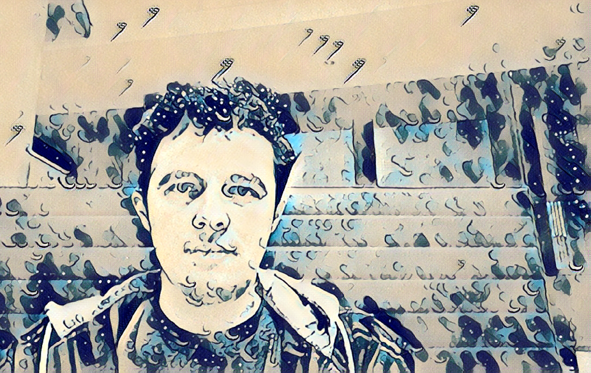

Style Transfer with Pytorch Library.

# Style Torch

StyleTorch is a small pytorch project for Real Time Style Transfer.

## Install

Install the required libraries ( may require to run as sudo ).

```bash
git clone https://github.com/TowardHumanizedInteraction/StyleTorch
cd StyleTorch
pip3 install -r requirements.txt
```

## Usage

The repository provides an usage application to apply style transfer on multiple screens and mutliple camera feeds.

```bash
python3 -m styletorch\
  -m [Path to Model 0] [Path to Model 1] [...]\
  -c [Camera Id 0] [Camera Id 1] [...]
```




### Training

```bash
# More option available 'python3 -m styletorch.train --help'
python3 -m styletorch.train\
  -e [Number of Epochs]\
  -b [Batch Size]\
  -f [Dataset Folder]\
  -S [Style Image Path]\
  -m [Model to Save Path]\
  -T [Path to the Save Test Image]\
  -d # Download Coco Dataset
```

### JIT & Quantize

```bash
# More option available 'python3 -m styletorch.jit --help'
python3 -m styletorch.train\
  -s [Model Path]\
  -d [New Model Path]\
  -q # Jit & Quantize the model
```

## References

* [[1]] Fast Neural Style Transfer (Pytorch)
* [[2]] Instance Normalization: The Missing Ingredient for Fast Stylization
* [[3]] Perceptual Losses for Real-Time Style Transfer and Super-Resolution

[1]: https://github.com/pytorch/examples/tree/master/fast_neural_style
[2]: https://arxiv.org/pdf/1607.08022.pdf
[3]: https://arxiv.org/pdf/1603.08155.pdf
